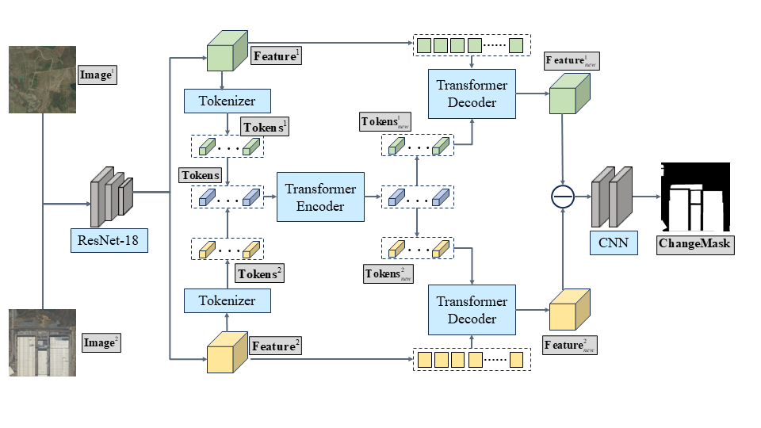
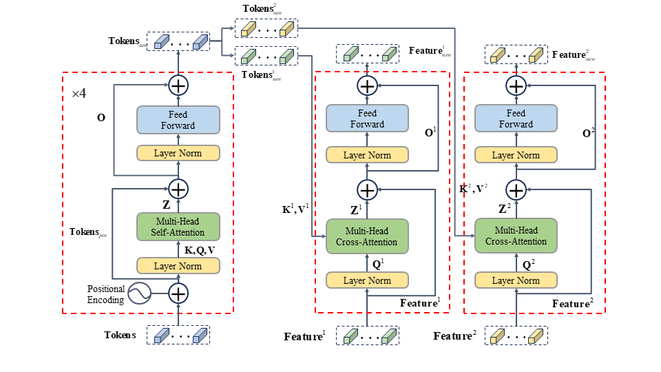

# Transformers变化检测网络模型说明（change detection）

## 程序说明

这个程序实现了自动化裁剪，识别，拼接并转化为shp文件，其核心是Transformers模型

程序出现bug请联系yaoshunyu9401@gmail.com






## Requirements
```
Python 3.10
pytorch 1.13.0
torchvision 0.14.0
einops  0.6.1
gdal  3.4.3
tifffile 
```

## 数据说明
数据集内有两个区县2022年和2023年的遥感影像，还有IWHR_data数据集。数据集分享链接如下

链接：https://pan.baidu.com/s/1lh1yuX_DC7M9tpKl2S_s8A 
提取码：4cix

### 数据准备

```
"""
两期影像的文件夹在dateset内；
├─T1
├─T2
├─label
└─crop_256
"""
```
`T1`: t1 phase;

`T2`: t2 phase;

`label`: label maps, 如果执行预测在此文件夹下放入名称与T1和T2同名的图像文件
，行列大小与T1和T2同名的图像文件一致，此图像不参与预测;

`crop_256`: contains `A, B, label, List and predict`, 
此文件夹及其内容可以自动生成，最终预测结果的shp文件也会放在此文件夹下.

### 数据集结构

```
"""
Change detection data set with pixel-level binary labels；
├─A
├─B
├─label
└─list
"""
```


## 运行脚本说明

### Predict

在文件夹下`scripts`找到训练脚本`run_server.sh` , 这个脚本集合了自动裁剪，
获取裁剪后的图片列表，读取数据并进行前向传播预测，对预测后的图斑赋予坐标拼接，并
转化为shp文件，过滤掉较小的图斑，实现对遥感影像的自动化图斑提取处理

可以在terminal中运行 `sh scripts/run_server.sh` (注意：检查python环境和路径，路径
要和python项目一致).

`run_server.sh` 内详细内容如下:

```cmd
#!/usr/bin/env bash

gpus=0

data_name=application
net_G=base_transformer_pos_s4_dd8
split=test
project_name=CD_base_transformer_pos_s4_dd8_LEVIR_b8_lr0.01_train_val_200_linear
checkpoint_name=best_ckpt.pt
echo $(date +%T)
python MyDataProcess/crop_size.py ./dataset 256
python MyDataProcess/get_list.py ./dataset/crop_256
echo $(date +%T)
python image_forwrd_.py --split ${split} --net_G ${net_G} --checkpoint_name ${checkpoint_name} --gpu_ids ${gpus} --project_name ${project_name} --data_name ${data_name}
echo $(date +%T)
python MyDataProcess/result_process.py ./dataset/crop_256
echo $(date +%T)

```


